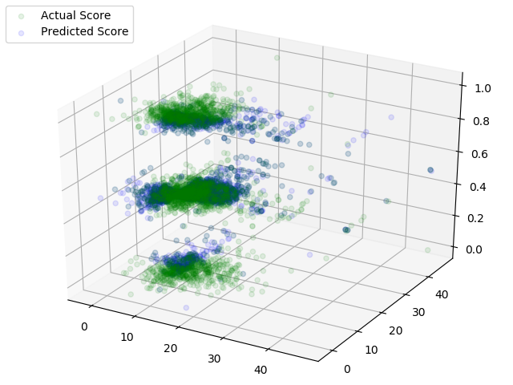

**********************************************************************
		CHESS RATINGS - ELO VERSUS THE REST OF THE WORLD
		
	Author: Emilija Zdilar
	Version: 1.0.0
	Date: 15.06.2018.

	This project is an Artificial Intelligence course
	assignment, written in Python.
	It is the solution to the past competition called 
	'Chess ratings - Elo versus the Rest of the World' 
	
	 		
**********************************************************************

Getting Started:

- Download and open project
- Create and activate virtual environment, as per your preference.
- pip install -r requirements.txt
- Navigate to project root folder
- python main.py
**********************************************************************

Notes:
- Each player's rating is calculated considering the outcome
  of the games against other players from the data set, as
  well as the recentness of the games. Also, small advantage 
  is given to white. Assumption is made too that the players
  participating in the same tournament are of similar level.
- Preparation of the dataset has already been made. In case 
  of any modifications, be considerate of the fact that the 
  the number of required operations is fairly big.

 Example: 
  

**********************************************************************

Prerequisites:
- Matplotlib 3.0.2
- Numpy 1.16.0
- Pandas 0.24.0
- scikit-learn 0.20.2

**********************************************************************

Acknowledgments:
- How I won the "Elo vs the rest of the world" 
  Competition, Yannis Sismanis, November 2010

**********************************************************************
